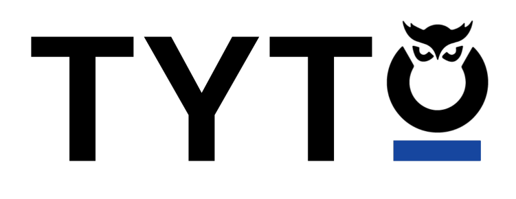
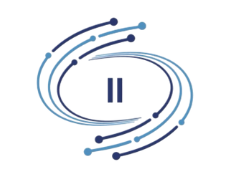

# AEGIS

  
  
  
  
  
  
 

  <h2 align="center">Project Oveview</h2>
  <!-- Project description here  -->
  
AEGIS (Advanced Evidence Gathering and Investigation System) is a secure, on-premise Digital Forensics and Incident Response (DFIR) platform designed to help cybersecurity teams investigate, collaborate, and manage cases involving digital evidence.

# Documentation Links

  
Demo 2

  | Document | Description |
  |----------|-------------|
  | [SRS](https://drive.google.com/drive/folders/1a484FLVYnxHlSkHjc4Zql1wG46k02IG6) | Demo 2 Documents |

  
Demo 3

  | Document | Description |
  |----------|-------------|
  | [SRS](https://drive.google.com/file/d/1lCT50PbuHdsouuJmu9K0-wVSYiKskYut/view?usp=sharing) | Demo 3 Documents |
  | [Architectural diagram](https://drive.google.com/file/d/10I5IYFkeHBX6L_WePDfX8Q5JswM1XnTc/view?usp=sharing) | Demo 3 Documents |
  | [Quality requirements](https://drive.google.com/file/d/1bEngPS-4aBUXjf5EynU4K1AATxPUpN_I/view?usp=sharing) |Demo 3 Documents |
  | [Deployment model](https://drive.google.com/file/d/1IORpxldCfHO4uxPluXhhs3yAHGH2b4Cr/view?usp=sharing) | Demo 3 Documents |
  | [Service contract](https://drive.google.com/drive/folders/1ypSboV9YTmVP0C6rjvPB-r5kd4u3oYjd?usp=sharing) | Demo 3 Documents |
  | [Coding standards](https://drive.google.com/file/d/1N63lDs5rWEVKWpBTXT2dibA0oVt74EoZ/view?usp=sharing) | Demo 3 Documents |
  | [User manual](https://drive.google.com/file/d/1gd_DFTVll9bDsyA8CVKC4sTIi-e_QJJR/view?usp=sharing) | Demo 3 Documents |
  | [Technical installation manual](https://drive.google.com/file/d/1k_1-4pNVTelEN1vtCNoU_zVSOenJAYFg/view?usp=sharing) |Demo 3 Documents|
  | [Technical requirements](https://drive.google.com/file/d/10yI44f_3lV42OwnvUVhe7tlSZMgeyAfP/view?usp=sharing) | Demo 3 Documents |
  
  

  
Demo 4

  
  | Document | Description |
  |----------|-------------|
  | [SRS](./docs/System Requirements Specifications V4.pdf) | Demo 4 Documents |
  | [Architectural diagram](./docs/Architecural Diagram V4) | Demo 4 Documents |
  | [Quality requirements](./docs/Quality_Requirements.pdf) | Demo 4 Documents |
  | [Deployment model](./docs/demo4/Deployment_Model.pdf) | Demo 4 Documents |
  | [Testing policy](./docs/demo4/Testing_Policy.pdf) | Demo 4 Documents |
  | [Coding standards](./docs/AEGIS Development Coding StandardsV4.pdf) | Demo 4 Documents |
  | [User manual](./docs/User Manual V4.pdf) | Demo 4 Documents |
  | [Technical installation manual](./docs/demo4/Technical_Installation_Manual.pdf) | Demo 4 Documents |
  | [User stories](./docs/User Stories v4.pdf) | Demo 4 Documents |
  

# Demos:
| Demo | Demo Slides | Demo Video |
|------|--------|------|
| Demo 1 | [Slides 1](https://www.canva.com/design/DAGokHxWRMc/CcAMEt2TOs7UyCsaF5az5Q/edit?utm_content=DAGokHxWRMc&utm_campaign=designshare&utm_medium=link2&utm_source=sharebutton) | [Video 1](https://www.canva.com/design/DAGovaFWF1A/9p8YYCu-lPYkveH85GLx3Q/edit?utm_content=DAGovaFWF1A&utm_campaign=designshare&utm_medium=link2&utm_source=sharebutton) |
| Demo 2 | [Slides 2](https://www.canva.com/design/DAGriVcVSVU/c-BVMfflQsWLy4KdUPE4Iw/edit) | [Video 2]() |
| Demo 3 | [Slides 3](https://www.canva.com/design/DAGwnL6taso/XXWV_-clkquLt6cd08SZuA/edit?utm_content=DAGwnL6taso&utm_campaign=designshare&utm_medium=link2&utm_source=sharebutton) | [Video 3]() |

# Project Management:
| Project board |  
|----------|
| [Github Project Board](https://github.com/orgs/COS301-SE-2025/projects/135/views/1?filterQuery=) | 

<!-- when needed, uncomment
# Technologies #

  

 -->

# Meet Incident Intel #

| Member             | Role | Links |
|--------------------|--------------|--------------|
| **Ofentse Modika** |*Services Engineer, Data Engineer, Integration Engineer* |   |
| **Onthatile Molebaloa** |*Services Engineer, UI Engineer* |   |
| **Tshireletso Sebake** |*Services Engineer, UI Engineer* |   |
| **Retshepile Nkwana** |*UI Engineer, Services Engineer* |   |
<!-- later 
<table>
  <tr>
    <td>- Contact us at <a href="mailto:bytesquad.capstone@gmail.com">capstone.incidentintel@gmail.com</a>.</td>
  </tr>
</table> -->

**A capstone Project for Tyto Insights**

  
  

